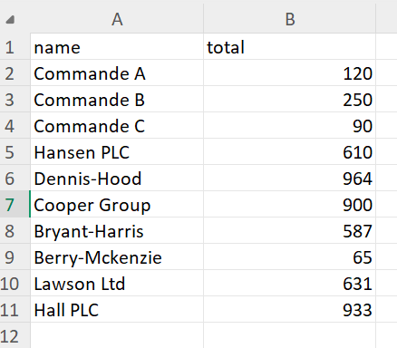

# demo_django_cbv
Demo of Django's Class-based Views

## Overview
This example is explained in detail in the accompanying Skool post:
👉 Read the full breakdown on Skool: https://www.skool.com/onboard-or-join-a-tech-team/why-djangos-class-based-views-scale-better-in-complexity

## Use case
This Django view demonstrates how to expose the same data source (orders) in multiple formats depending on a query parameter:

- HTML (default): renders a standard list page using a template.
- JSON (?format=json): returns a machine-readable response for APIs or frontend apps.
- CSV (?format=csv): allows users to download the data for reporting or spreadsheet analysis.

This pattern is useful when:

- You want a single endpoint for both humans and machines.
- You need quick data exports without creating a separate admin or API view.
- You want to showcase how a Django Class-Based View can be extended without rewriting all the logic.

## CSV export (`orders.csv`)
When requesting `?format=csv`, the response triggers a file download named `orders.csv`.

The file contains:
- One header row
- One row per order

  

